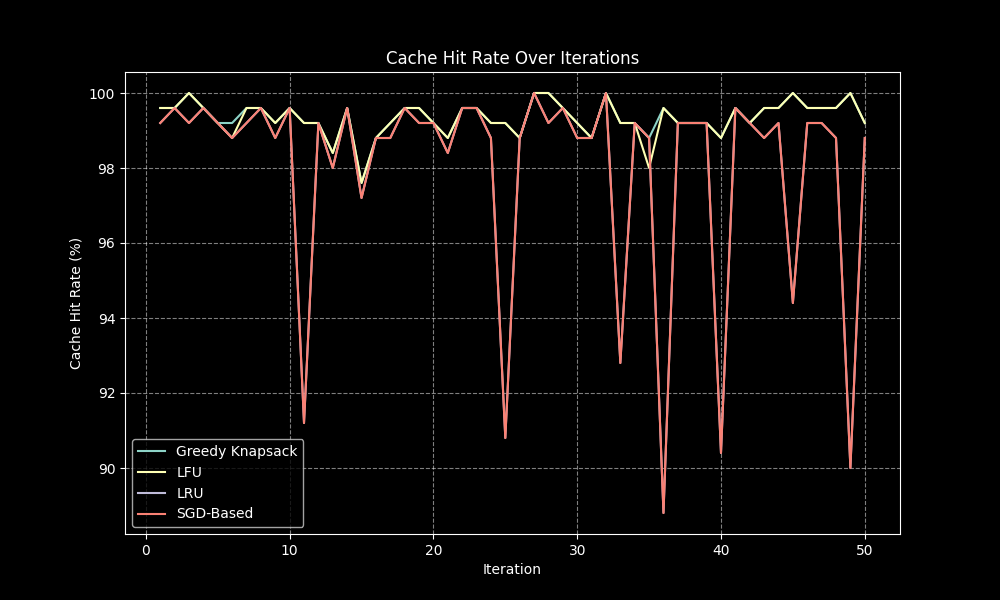

# Comparing Knapsack-Based Stochastic Gradient Descent Approach To Typical Web Caching Methods

## Overview

This project was developed as part of my senior research at **Bowie State University**.
It evaluates and compares the effectiveness of a **Knapsack-Based Stochastic Gradient Descent (SGD) approach** to traditional web caching methods such as **LRU (Least Recently Used)**, **LFU (Least Frequently Used)**, and **Greedy Knapsack** strategies.

The system simulates **multi-client request patterns** against a central Flask-based cache server, applies different caching algorithms, and records performance metrics across multiple iterations. Results are then summarized and visualized for direct comparison.

---

## Design Highlights

* **Multi-client simulation** with Zipfian request distribution to reflect real-world traffic.
* **Flask server backend** simulating cacheable content with configurable latency/size.
* **SGD-based optimization** compared to baseline algorithms (LRU, LFU, Greedy).
* **Automated pipeline** that handles data preprocessing, caching, simulation, logging, and results aggregation.
* **Visual outputs** of cache hit rates, latency reduction, and cache usage.

---

## Project Structure

```
├── src/                    # Source code (organized by modules)
│   ├── analysis/           # Metrics & visualization
│   ├── data/               # Preprocessing
│   ├── models/             # Caching strategies
│   ├── pipeline/           # Full automation & request simulation
│   └── server/             # Flask server
│
├── Sample_output/           # Representative example results
│   ├── interim_data/
│   ├── logs/
│   ├── result_data/
│   └── result_visuals/
│
├── requirements.txt         # Python dependencies
├── README.md
└── .gitignore
```

---

## Example Output

Because results vary (stochastic inputs and random seeds), this repository includes a **`Sample_output/`** directory with representative runs:

* **`Sample_output/result_data/`** → CSV summaries of cache hit rates and latency reduction
* **`Sample_output/result_visuals/`** → plots of cache usage, hit rate, and latency reduction
* **`Sample_output/logs/`** → example runtime logs from the Flask server and pipeline

### Example Visualization

Cache hit rate across iterations:



---

## Installation

Ensure you have **Python 3.9+** installed.

```bash
git clone https://github.com/DamienTicer/Web-Caching-with-SGD.git
cd Web-Caching-with-SGD
python -m venv venv
source venv/bin/activate   # On Windows: venv\Scripts\activate
pip install -r requirements.txt
```

---

## Running the Full Pipeline

Run the end-to-end automation:

```bash
python -m src.pipeline.pipeline_automation
```

After completion, run the metrics summary:

```bash
python -m src.analysis.metric_summary_analysis
```

Results will appear under `result_data/` and `result_visuals/`.

---

## Running Individual Components (Optional)

If you prefer step-by-step execution:

```bash
python -m src.server.server             # Start Flask server
python -m src.pipeline.simulate_requests
python -m src.data.data_preprocessing
python -m src.models.sgd_cache_optimizer
python -m src.models.cache_baselines
python -m src.analysis.analyze_results
python -m src.analysis.metric_summary_analysis
```

---

## Notes

* The pipeline automatically cleans and regenerates logs at each run.
* Each iteration simulates multiple clients asynchronously.
* Results vary across runs, but trends remain consistent.
* Example outputs are included in `Sample_output/` for reference.

---

## Author

**Damien Ticer**

* Computer Science Graduate, Bowie State University
* [GitHub Portfolio](https://github.com/DamienTicer)